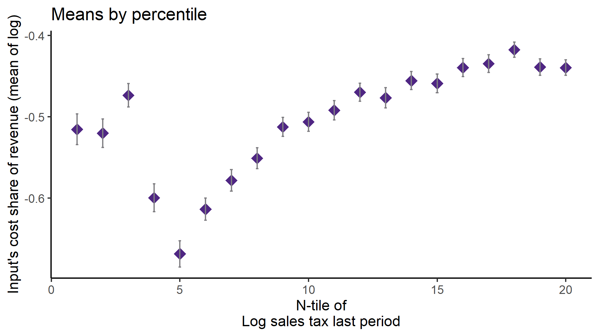
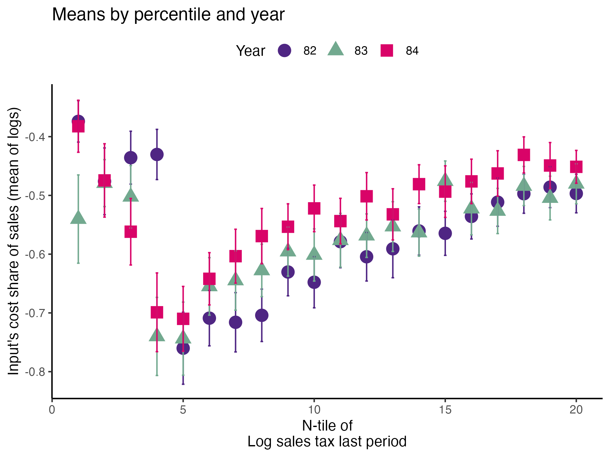
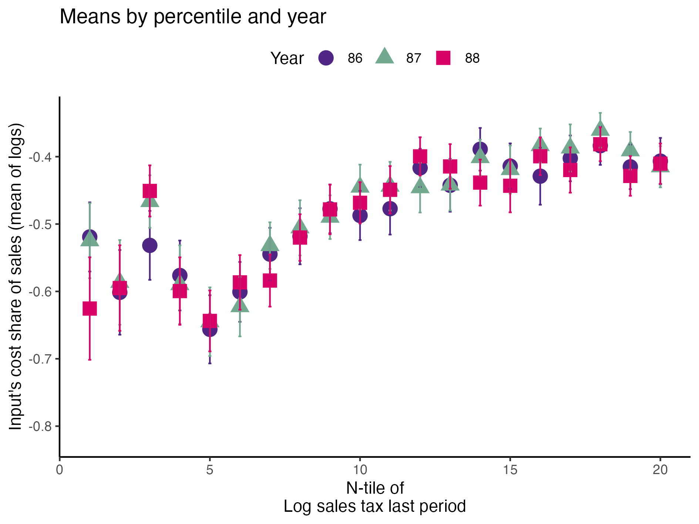
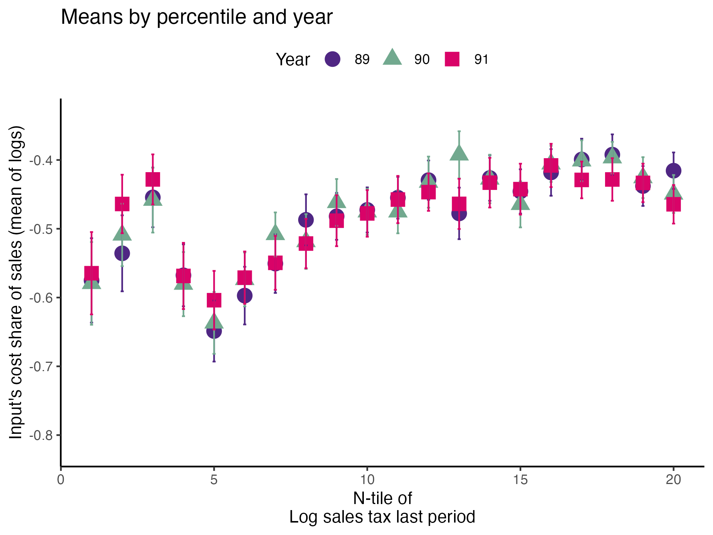
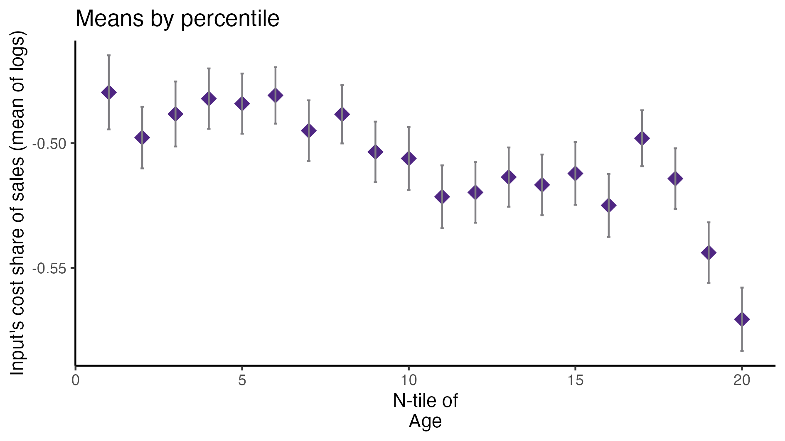
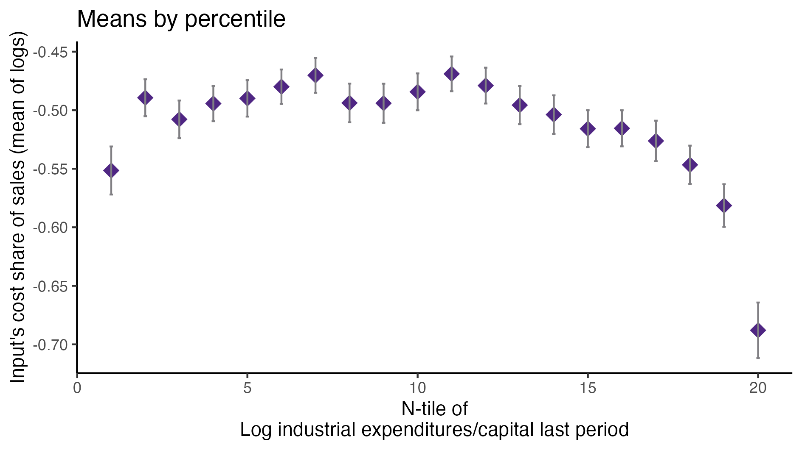

```{r setup, include=FALSE}
options(htmltools.dir.version = FALSE)
knitr::opts_chunk$set(
  fig.width=9, fig.height=3.5, fig.retina=3,
  out.width = "100%",
  out.height = "90%",
  cache = FALSE,
  echo = FALSE,
  message = FALSE, 
  warning = FALSE,
  hiline = TRUE
)
library("kableExtra")
# library("tydiverse")
```

```{r xaringan-themer, include=FALSE, warning=FALSE}
library(xaringanthemer)
style_duo_accent(
  primary_color = "#4F2683",
  secondary_color = "#807F83",
  inverse_header_color = "#FFFFFF",
  inverse_text_color = "#FFFFFF",
  inverse_background_color = "#4F2683",
  base_font_size = "30px",
  title_slide_background_image = "Horizontal_Rev.png",
  title_slide_background_size = "4.5% no-repeat",
  title_slide_background_position = "bottom",
  extra_css = list(
  ".small" = list("font-size" = "80%", 
                  "color" = "#807F83"),
  ".large" = list("font-size" = "130%", 
                  "color" = "#4F2683",
                  "font-family" = "var(--header-font-family)",
                  "font-weight" = "600"),
  ".full-width" = list(
    display = "flex",
    width   = "100%",
    flex    = "1 1 auto"
    ),
  ".footer" = list("color"    = "#807F83",
                   "position" = "fixed",
                   "top"      = "95%",
                   "left"     = "0",
                   "text-align"= "left",
                   "width"    = "50%",
                   "font-size"= "80%"
                     )
  ),
  header_font_google = google_font("Merriweather", "400","400i","700"),
  text_font_google   = google_font("Arimo", "400", "400i"),
  code_font_google   = google_font("IBM Plex Mono")
)
```
name: over-r
count: false
### Tax evasion by cost overreporting

- Cost overreporting arises when firms acquire false invoices to **claim additional tax deductions** on value-added and corporate income taxes. 

--
count: false

- According to a report from the OECD .small[(2017)], cost overreporting permeates **internationally** reaching Latin America, Eastern Europe, Asia, and Africa .small[ [&#9654; Estimates](#estimates)]


--
count: false

- Recent **evidence** from Ecuador .small[ [&#9654; (Carrillo et al. 2022)](#carrillo)]

  - Quantitatively large .small[up to 14% of a firm's annual purchases]
  - Widespread across firms .small[not exclusive to small, semiformal firms]
  - Very large firms do not overreport inputs .small[Sophisticated: Profit shifting (Bustos et al., 2022); Higher risk of getting caught: 3rd-party reporting (ISO), gov't attention]

???

- Mexico .small[(Tax revenue loss 0.3% Mexico's GDP)], Colombia .small[(0.2%)], Chile .small[(0.2%)], Poland .small[(5.6%)], Asia .small[(South Korea and China)], and Africa .small[(Kenya and Rwanda)] 

.footer[[&#9654; Evasion vs Avoidance](#tax-conv)]


---
### Research Questions

- Even governments with detailed administrative data have difficulties detecting tax evasion because firms conceal their behavior

> How can a researcher **estimate tax evasion** when only **manufacturing surveys** are available?

--
count: false
- If overreporting is so widespread and quantitatively large, then our measures of productivity are likely to be biased

> How can a researcher **recover productivity** in the presence of **tax evasion**?

--
count: false
- The fundamental **challenge** is that both tax evasion and productivity are **unobserved**

---
count: false
name: lit
### Contribution

- I provide a **new estimation strategy** to recover [&#9654;**tax evasion**](#tax-stats) using firm-level data

  - [&#9654; Corporate tax evasion](#firms-evasion) by cost overreporting .small[(a.k.a. "fake invoicing", "ghost firms", "invoice mills", or "missing traders": Carrillo et al., 2022; Zumaya et al., 2021; Waseem, 2020; Mittal et al., 2018 )]

--
count: false
- I show that ignoring tax evasion leads to **biased estimates** of productivity
  - Production function and productivity estimation .small[(Gandhi, Navarro, and Rivers, 2020 [GNR]; Ackerberg et al., 2015); Productivity gap (Syverson, 2011)]


???

- I estimate productivity despite the **systematic** overreporting of **intermediates**

- Measurement error on capital .small[(Collard et al., 2020; Ursenbach, 2022)]

---
class: middle

### KEY INSIGHT

>In the absence of tax evasion, the first-order conditions (FOC) of the cost-minimization problem of the firms reveal the production function parameters (common technology) and the output shock distribution 

>In the presence of tax evasion, the subset of non-evading firms allows to recover the true common technology and the output shock distribution

>The deviations from the common technology that are not explained by the output shock reveal the tax evasion distribution

---
layout: false
### The standard setting

We observe output $Y_{it}$, reported inputs $K_{it},L_{it}, M_{it}$, and output $P_t$ and intermediate input prices $\rho_t$. 

$\mathcal O = \{Y_{it}, K_{it},L_{it}, M_{it}, P_{t}, \rho_t\}_{i\in I, t \in T}$
  
We want to estimate the production function $G$ and productivity $\omega_{it}$

$Y_{it}=G(K_{it},L_{it}, M_{it})e^{\omega_{it}+\varepsilon^Y_{it}}$, where $\varepsilon^Y_{it}$ is the output shock with $\mathbb{E}[\varepsilon^Y_{it}]=0$

???

- We are also interested in the Markov process of productivity (AR1)

$\omega_{it}=\delta_0 + \delta_1 \omega_{it-1}+\eta_{it}$ with $\mathbb{E}[\eta_{it}|\omega_{it-1}]=0$


---
name: bias
### Tax evasion and the productivity bias

Firms overreport their intermediate inputs $M^*_{it}$ by $e^{\varepsilon^M_{it}}$ to evade taxes


\begin{equation}
M_{it}=M^*_{it}e^{\varepsilon^M_{it}} \text{with } \varepsilon_{it}^M\ge0
\end{equation}

Bias: Difference between the naively estimated $\tilde\omega_{it}$ and true productivity $\omega_{it}$

\begin{equation}
 \mathbb{E}[\tilde\omega_{it}|\mathcal{I}_{it}]-
    \mathbb{E}[\omega_{it}|\mathcal{I}_{it}] \le
      \ln\mathbb{E}\left[
        \frac{G(K_{it},L_{it}, M_{it}^*)}{G(K_{it},L_{it}, M_{it}^* e^{\varepsilon^M_{it}})}\Bigg|\mathcal{I}_{it}\right] \le 0
\end{equation}

where $\mathcal{I}_{it}$ is the information set of firm $i$ in time $t$

.center[
.small[By Jensen's inequality and because *G(X)* is monotonically increasing]
]

???

.footer[ [&#9654; Bias in PF parameters](#prd-bias)]


---
layout: false
name: id-strat
### Identification strategy

- Assumptions: 
  
  - (A-1: Non-Evaders) Firms above threshold $s$ of size $S$ do not overreport inputs
  
  - (A-2: Independence) Firms choose input overreporting $\varepsilon^M_{it}$ *before* the output shock $\varepsilon^Y_{it}$ 

???

- Data: 
  - Firm-level data from Ecuador: Inputs, outputs, and prices </br>.small[[&#9654; Sum-stats](#sum-stats) [&#9654; Access](#data-slide)]
  - Threshold of the size distribution for non-evading firms .small[(Carrillo et al., 2022)</br>[&#9654; Contingency plan](#contingency)]
  


---
layout: false
name: gnr
### Estimating the production function

Assume Cobb-Douglas: $G(K_{it},L_{it}, M_{it})e^{\omega_{it}+\varepsilon^Y_{it}}=K_{it}^{\beta_K}L_{it}^{\beta_L}M_{it}^{\beta_M}e^{\omega_{it}+\varepsilon^Y_{it}}$

From the FOC of the cost minimization problem of the firms

\begin{align*}
    \ln\left(\frac{\rho_t M_{it}}{P_{t}Y_{it}}\right)&=\ln\beta_M - \varepsilon^Y_{it} \\
    \mathbb{E}\left[\ln\left(\frac{\rho_t M^*_{it}}{P_{t}Y_{it}}\right)| S_{it}>s\right]+\mathbb{E}[\varepsilon^M_{it}| S_{it}>s]&=\ln\beta_M - \mathbb{E}[\varepsilon^Y_{it}| S_{it}>s]\\
    \mathbb{E}\left[\ln\left(\frac{\rho_t M^*_{it}}{P_{t}Y_{it}}\right)| S_{it}>s\right]&=\ln\beta_M
\end{align*}


---
exclude: true

### Failing to estimate productivity's AR(1)

GNR's 2nd stage can be computed only for $S_{it}>s$

\begin{align}
    \mathcal Y_{it}&\equiv \ln Y_{it}-\varepsilon^Y_{it}-\beta \ln X_{it}\\
    &= \omega_{it}\\
    \\
    \mathbb{E}[\mathcal Y_{it}|\mathcal Y_{it-1},S_{it}>s] &= \delta_0+\delta_1\mathbb{E}[\omega_{it}|\omega_{it-1},S_{it}>s] + \mathbb{E}[\eta_{it}|\omega_{it-1},S_{it}>s]
\end{align}

You can't recover $\delta=[\delta_0,\delta_1]'$ because of the selection on $S$, i.e., 

$$\mathbb{E}[\eta_{it}|S_{it}>s]\not=\mathbb{E}[\eta_{it}]\not=0$$

---
exclude: true
### Recovering tax evasion

For every firm, form $\mathcal E_{it}$ using input cost share of sales and the output elasticity of intermediates $\beta_M$ from 1st stage

\begin{align}
    \mathcal E_{it}\equiv&\ln\left(\frac{\rho_t M_{it}}{P_{t}Y_{it}}\right)-\ln\beta_M\\
    &=\ln\left(\frac{\rho_t M^*_{it}}{P_{t}Y_{it}}\right)-\ln\beta_M+\varepsilon^M_{it}\\
    &=-\varepsilon^Y_{it} +\varepsilon^M_{it}
\end{align}

$\mathcal E_{it}$, tax evasion up to the output shock

---
exclude: true

### Trading unobservables

Likewise,

\begin{align}
    \mathcal X_{it}&\equiv \ln X_{it}-\mathcal E_{it}\\
    & = \ln X^*_{it} +\varepsilon^X_{it}-(\varepsilon^X_{it}- \varepsilon^Y_{it})\\
    & = \ln X^*_{it} + \varepsilon^Y_{it}\\
    \\
    \mathcal W_{it} & \equiv \ln Y_{it} - \beta\mathcal X_{it}\\
    & = \beta\ln X^*_{it}+\omega_{it}+\varepsilon^Y_{it}-\beta\ln X^*_{it}-\beta\varepsilon^Y_{it} \\
    & = \omega_{it}+(1-\beta)\varepsilon^Y_{it}
\end{align}

---
name: markov
exclude: true

### Markov process of productivity


I can now recover $\delta$

\begin{align}
  \mathbb{E}[\mathcal W_{it}|\mathcal W_{it-1}]=&\\
  \mathbb{E}[\omega_{it}|\mathcal W_{it-1}]=&\delta_0+\delta_1\mathbb{E}[\omega_{it-1}+(1-\beta)\varepsilon^Y_{it-1}|\mathcal W_{it-1}]\\
  &-\mathbb{E}[(1-\beta)\varepsilon^Y_{it}|\mathcal W_{it-1}]
  +\mathbb{E}[\eta_{it}|\mathcal W_{it-1}]\\
  \\
  =&\delta_0+\delta_1\mathbb{E}[\omega_{it-1}|\mathcal W_{it-1}]
\end{align}

.footer[Preliminary MC simulations: [&#9654; DGP](#mc-sim)[&#9654; Results](#mc-res)]

---
exclude: true
name: deconv
### Using deconvolution

From the 1st stage, I also learn the **distribution** $m$ of $\varepsilon^Y_{it}$

#### Result from probability theory:
> The density of the sum of two *independent* random variables is equal to the *convolution* of the densities of both addends; hence

\begin{equation*}
  h^d= f^d*m = \int f^d(\mathcal Z^d - \varepsilon^Y)m(\varepsilon^Y)d\varepsilon^y
\end{equation*}

> where $h^d$ is the density of $\mathcal Z^d\in \{\mathcal{E,X,W}\}$ .small[(Meister, 2009)]

I can use non-parametric density **deconvolution methods**

---
exclude: true
### Deconvolution: the intuition

For every $n$-th moment $\mathbb{E}[(\varepsilon^{Y}_{it})^n|S_{it}>s]=\mathbb{E}[(\varepsilon^{Y}_{it})^n|t]=\mathbb{E}[(\varepsilon^{Y}_{it})^n]$

Therefore, I can get any moment of the tax evasion $\varepsilon^X_{it}$ distribution $\forall t\in T$

For example: 
\begin{align}
  \mathbb{E}[\mathcal E_{it}|t]&=\mathbb{E}[\varepsilon^X_{it}|t]-\mathbb{E}[\varepsilon^Y_{it}]=\mathbb{E}[\varepsilon^X_{it}|t] \\
  \\
  \mathbb{Var}[\mathcal E_{it}|t]&=\mathbb{Var}[\varepsilon^X_{it}|t]
  +\underbrace{\mathbb{Var}[\varepsilon^Y_{it}]}_{known}\\
\end{align}

---
exclude: true
### The power of deconvolution

- Using $\mathcal E_{it}$, I can learn the **distribution of tax evasion** and how it has **evolved**

- Using $\mathcal{W}_{it}$, I learn the **distribution of productivity** $\omega_{it}$ and how it has **evolved**

- Moreover, I can get any mixed moment $\mathbb{E}[(\mathcal{Z}^c, \mathcal{Z}^d)^n|t]$
  - I can learn how **tax evasion** changes with **productivity**, e.g.,

\begin{align}
  \mathbb{Cov}[\mathcal{E}_{it},\mathcal{W}_{it}|t]&=\mathbb{E}[\varepsilon^X_{it}\omega_{it}|t]
  -\underbrace{
    (1-\beta)\mathbb{E}[(\varepsilon^{Y}_{it})^2]-\mathbb{E}[\varepsilon^X_{it}|t]\mathbb{E}[\omega_{it}|t]}_{
    known
    }
\end{align}

---
class: inverse center middle last

# Colombia 1981-1991: An application

---
### Colombia 1981-1991

Colombia passed three major fiscal policy changes during this period, in **1983, 1986, and 1990** .small[(Sanchez & Gutierrez, 1994; Gonzalez & Calderon, 2002; Sanchez & Espinoza, 2005; )]. 

Their main objectives were to **increase government tax revenue**, decrease tax evasion, and open Colombia's economy to foreign markets.

I focus on the Corporate income tax (profit tax) and sales tax/Value Added Tax (VAT). .small[45-70% of Colombia's tax revenue income]

.small[In Colombia, the tax law refers to individuals as natural persons and firms (societies) as juridic persons. During the early 80s, it was common for individuals to own companies registered under their name (natural persons)]

---
### Corporate income tax rate (1981-1985)

In 1983, the maximum rate of the progressive tax schedule decreased from 56% to 49% (individuals), and from 20% to 18% for small non-public firms (limited societies, 1-25 partners)

Elimination of double taxation for public firms (Anonymous societies)

However, the **1983 reform expanded the base** of firms required to pay profit taxes. Firms with profits greater than $200,000 COL were now required to report profit taxes.

From **1983 to 1985**, the tax authority focused **administrative control on the 5% biggest** taxpayers that represented 80% of the government tax revenue. 

---
### Corporate profit tax rate (1986-1991)

With the reform of **1986**, the government **relocated** the tax collection and reception of tax reports to the **banking system**. 

The reform also reinforced the control over the big taxpayers. 

The 1986 reform decreased the maximum tax rate for individuals by 1% annually from 33% in 1986 to 30% in 1989.

---
### Value Added Tax (VAT)

The 1983 reform established the VAT at 10%

Before, only a sales tax of 6% on manufacturing firms. VAT extended to cover the distribution, commerce, and final sale to consumers

In 1990, the VAT increased from 10% to 12%

---
class: center middle
exclude: true

```{r , echo = FALSE, out.width='90%', fig.align='center'}
knitr::include_graphics('../Results/Figures/Colombia/share_sales_tax_byy.png')
```


---
class: center middle

```{r , echo = FALSE, out.width='90%', fig.align='center'}
knitr::include_graphics('../Results/Figures/Colombia/log_share_byy.png')
```

---
class: center middle
exclude: true

```{r , echo = FALSE, out.width='90%', fig.align='center'}
knitr::include_graphics('../Results/Figures/Colombia/log_sales_byy.png')
```


---
class: center middle

```{r , echo = FALSE, out.width='90%', fig.align='center'}

```

---
class: center middle


```{r , echo = FALSE, out.width='78%', fig.align='center'}

```

---
class: center middle
exclude: true

```{r , echo = FALSE, out.width='78%', fig.align='center'}

```

---
class: center middle
exclude: true

```{r , echo = FALSE, out.width='78%', fig.align='center'}

```

---
class: center middle


```{r threshold, echo = FALSE, results='asis', out.height='50%'}

# library(pander)
library(kableExtra)
library(fixest)

load("../Results/Tables/Colombia/regression_tables.RData")

my_style = style.df(
  depvar.title = "", 
  fixef.title = "", 
  fixef.suffix = " FE"#, 
  # yesNo = "yes"#,
  # threshold_model.1 = "(1)",
  # threshold_model.2 = "(2)"#,
)

setFixest_etable(markdown = TRUE, style.df = my_style)


setFixest_dict(c(
    treatment = "Affected firms", 
    time = "Year of 1983",
    log_share = "Inter. cost share of sales (logs)", 
    sic_3 = "Industry",
    metro_area_code = "Metropolitian area",
    `treat_fact1-15%` = "1-15%",
    `treat_fact20-50%` = "20-50%",
    `treat_fact55-75%` = "55-75%",
    `treat_fact80-95%` = "80-95%",
    year_fct84 = "Year of 1984",
    year_fct85 = "Year of 1985",
    year_fct86 = "Year of 1986",
    year_fct87 = "Year of 1987",
    year_fct88 = "Year of 1988",
    year_fct89 = "Year of 1989",
    year_fct90 = "Year of 1990"#,
))

etable(
    threshold_model,
    adjustbox = 0.6
    # arraystretch = 0.6
    # div.class = "table-unshaded"
    # headers = list(
    #   "(1)"=1,
    #   "(2)"=1
    # )
    # postprocess.df = kbl#, 

) #%>%
# kbl(caption="Change in sales threshold to report income taxes in 1983") %>%
# kable_paper(
#   # 'basic',
#   full_width = FALSE,
#   html_font = "Cambria",
#   font_size = 22
# ) %>%
# footnote(
#   general = "Control group 10% and 95% of taxes paid last period distribution. 1982 is the base year."
# )

```

```{r coefs, echo = FALSE, results='asis'}

model1_coefs <-coef(threshold_model)
e_coef <- exp(model1_coefs["treatment:time"])-1

cat(".footer[Tax evasion decreased by ",round(e_coef[[1,1]]*100,1),"%]")

```

---
class: center middle
exclude: true

```{r did_1983_2, echo = FALSE, results='asis'}

etable(
    did_1983,
    # keep = "%%",
    drop = "x"#,
    # arraystretch = 0.6
) #%>%
# kbl(caption="Fiscal reform of 1983") %>%
# kable_paper(
#   # 'basic',
#   full_width = FALSE,
#   html_font = "Cambria",
#   font_size = 17
# ) %>%
# footnote(
#   general = "Control group top 5% of sale taxes paid last period. Reference year is 1983."
# )

```

.pull-left[
  .small[
    from -15% (1-15%) to -1% (80-95%), 
  ]
]

---
class: center middle

```{r did_1983, echo = FALSE, results='asis'}

etable(
    did_1983,
    keep = "%:",
    # arraystretch = 0.6
    drop = "84",
    adjustbox = 0.45
) #%>%
# kbl(caption="Fiscal reform of 1983") %>%
# kable_paper(
#   # 'basic',
#   full_width = FALSE,
#   html_font = "Cambria",
#   font_size = 17
# ) %>%
# footnote(
#   general = "Control group top 5% of sale taxes paid last period. Reference year is 1983."
# )

```


.footer[Evasion rose ~8-9%]


---
class: center middle
exclude: true

```{r did_1986, echo = FALSE, results='asis'}

etable(
    did_1986,
    # keep = "%%",
    drop = "x",
    adjustbox = 0.45
    # arraystretch = 0.6
) #%>%
# kbl(caption="Fiscal reform of 1986") %>%
# kable_paper(
#   # 'basic',
#   full_width = FALSE,
#   html_font = "Cambria",
#   font_size = 17
# ) %>%
# footnote(
#   general = "Control group top 5% of sale taxes paid last period. Reference year is 1986."
# )

```


---
class: center middle

```{r did_1986_2, echo = FALSE, results='asis'}

etable(
    did_1986,
    keep = "%:",
    drop = "89",
    adjustbox = 0.45#,
    # arraystretch = 0.6
) #%>%
# kbl(caption="Fiscal reform of 1986") %>%
# kable_paper(
#   # 'basic',
#   full_width = FALSE,
#   html_font = "Cambria",
#   font_size = 17
# ) %>%
# footnote(
#   general = "Control group top 5% of sale taxes paid last period. Reference year is 1986."
# )

```

.footer[Tax evasion halted]


---
### Conclusions

Firms that were required to report income tax in 1983 reduced tax evasion by 14%

Evidence suggests that tax evasion through cost overreporting increased after the reform of 1983 between 8 and 9% in 1985 and 1986

This result stands at odds with previous studies that indicate that the evasion of income tax and VAT declined during this period .small[(Sanchez & Gutierrez, 1994)]

Likewise, evidence suggests that tax evasion growth stopped after the 1986 reform


---
### Future steps

- Colombia: Productivity
- Ecuador: Tax evasion and productivity with validation data
- Non-constant output elasticity of intermediate
- Chile, Mexico

---
name: final_slide
count: false
layout: false
class: center middle last

[hansmartinez.com](https://hansmartinez.com)

```{r, out.width="90%"}
library(qrcode)
qr <- qrcode::qr_code('https://raw.githack.com/hans-mtz/Slides/main/Slides/CEA-2023.html')
plot(qr)

```

.small[ Download slides: Scan QR with your phone's camera ]

<!-- .center[Link to slides: Scan me!] -->
<!-- .footer[ .full-width[Hello there]] -->

---
class: inverse center middle 
count: false
## Appendix


---

```{r , echo = FALSE, out.width='90%', fig.align='center'}

```

---

```{r , echo = FALSE, out.width='90%', fig.align='center'}

```

---
name: estimates

### Cost overreporting estimates

Cost overreporting reportedly generated annual tax revenue losses amounting to 

- 5.6% of Poland's GDP in 2016 (Poland's Minister of Finance, 2018); 
- 0.2% of Chile's GDP in 2004 (Gonzalez and Velasquez, 2013; Jorrat, 2001; CIAT, 2008); 
- 0.2% of Colombia's GDP (Portafolio, 2019); and 
- 0.03% of Mexico's GDP in 2018 (Senado de la Republica, 2019)

.footer[[&#9654; Back](#over-r)]